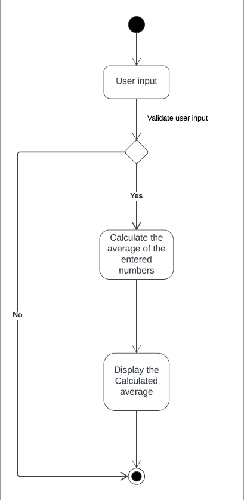

# AcceleratedC++_4_7
---

## Dependencies
- C++ 
- CMake
- Cpplint
- Cppcheck

## Steps to run the project
```
cd AcceleratedC++_4_7
mkdir build
cd build
cmake ..
make
Run program: ./app/CalculateAverage
```
## Activity Diagram 

## Key Points to remember
```
- To end terminal line input press " Ctrl + D "
- Make sure to follow the instructions printed in the terminal
- Please enter each input in a new line.
```
